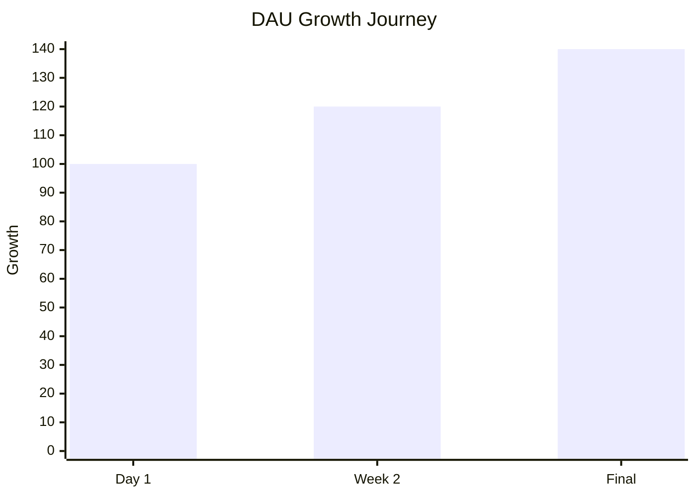
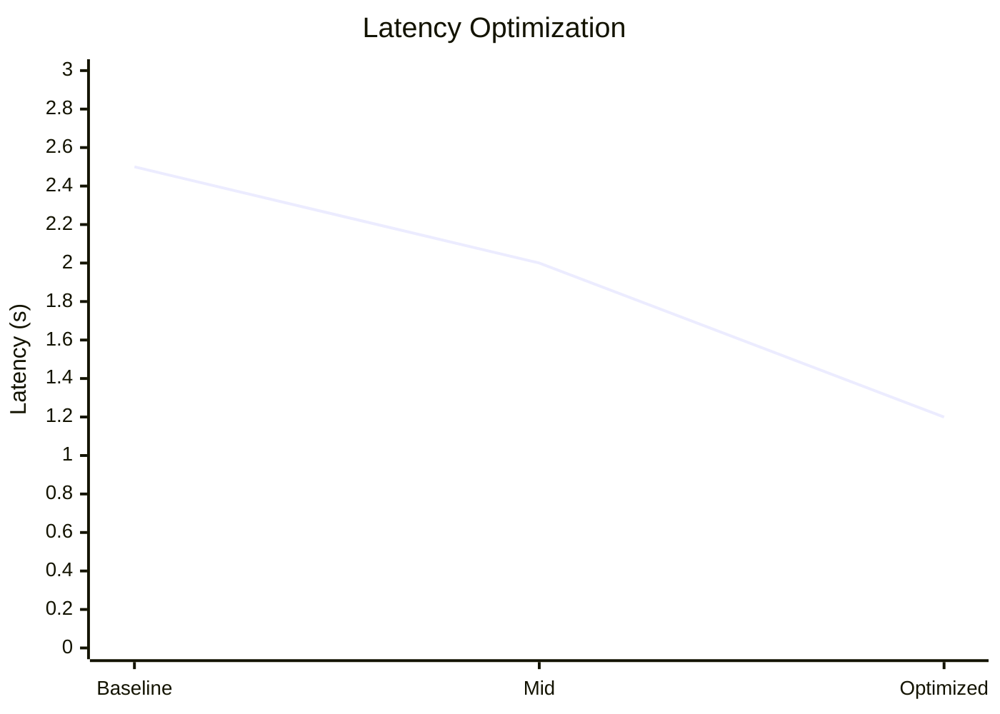

# Sujal Singh

<div align="center">
  <h2>Building AI-powered products that move metrics</h2>
  
  <p>
    
    
    
  </p>
  
  <p>
    
    
    
  </p>
</div>

---

## Impact Snapshot

<div align="center">

| Metric | Impact | Status |
|:---:|:---:|:---:|
|  | theGoodBrowser | ✅ |
|  | Week-1 Lift | ✅ |
|  | Performance Win | ✅ |
|  | Automation | ✅ |
|  | Optimization | ✅ |
|  | Production | ✅ |

</div>

---

## Core Competencies

### Product & Growth


### AI & LLM Systems


### Backend & Infrastructure


### Cloud & DevOps


---
## Growth and Performance metrics



---

## Featured Projects

### AI-Powered Company Research Assistant
<div style="background: linear-gradient(135deg, #667eea 0%, #764ba2 100%); padding: 20px; border-radius: 8px; color: white; margin: 15px 0;">

**🎯 Impact Metrics**

```
Response Time: <30s          Uptime: 99.5%
vs Manual: -90% faster      Speed: +35%
```

**Stack:**


Real-time company insights replacing 2+ hour manual research. Cache-first architecture with intelligent embedding-based retrieval.

</div>

### Context-Grounded Use Case Generator
<div style="background: linear-gradient(135deg, #f093fb 0%, #f5576c 100%); padding: 20px; border-radius: 8px; color: white; margin: 15px 0;">

**🎯 Impact Metrics**

```
Effort Reduction: 60-70%    Accuracy: 95%
Format: Structured JSON     Trust: Source-grounded
```

**Stack:**


Hybrid RAG ensemble (vector + BM25) with hallucination guards. Multi-modal ingestion supporting PDFs, Word docs, and images.

</div>

### Self-Correcting Hybrid Research Assistant
<div style="background: linear-gradient(135deg, #4facfe 0%, #00f2fe 100%); padding: 20px; border-radius: 8px; color: white; margin: 15px 0;">

**🎯 Impact Metrics**

```
Irrelevant Results: -40%    Search Type: Hybrid
Vector Dims: 384-d          Error Recovery: Auto-retry
```

**Stack:**


Validation-driven self-correction with regex date parsing + cosine KNN search on custom vector DB.

</div>

### AI Resume Screener
<div style="background: linear-gradient(135deg, #fa709a 0%, #fee140 100%); padding: 20px; border-radius: 8px; color: white; margin: 15px 0;">

**🎯 Impact Metrics**

```
Batch Size: 15+ resumes     Speed: 4-5 seconds
Scoring: 0-100 scale        Hire Signal: Yes/No/Maybe
```

**Stack:**


Eliminates manual review overhead with structured scoring and hiring signals.

</div>

---

## Experience

### AI Engineer Intern (Product & Growth) - theGoodBrowser
**May – July 2025**

<div align="center">

| Focus | Outcome | Tag |
|:---:|:---:|:---:|
|  | DAU, Activation, Latency | Core |
|  | 3 tests, +40% DAU | Growth |
|  | 2.5s→1.2s latency | Perf |
|  | Alfred AI Assistant | Launch |
|  | 100+ users, NPS loops | Scale |

</div>

Instrumented core metrics to anchor feature prioritization. Diagnosed 35% onboarding drop-off via cohort analysis, ran 3 A/B tests → lifted DAU 40%, week-1 retention to 85%. Debugged performance issues (2.5s → 1.2s latency) → +30% task completion success rate. Shipped Alfred (WhatsApp + Gmail + Calendar AI assistant) for 100+ users.

---

### Fullstack AI Intern (Product Infrastructure) - Sernion Technologies
**August – October 2025**

<div align="center">

| Responsibility | Impact | Tag |
|:---:|:---:|:---:|
|  | Bottleneck ID | Design |
|  | +20% efficiency | Scale |
|  | 12→4 rollbacks | Quality |
|  | 98% accuracy | Goals |
|  | 30% overhead cut | Efficiency |

</div>

Owned ML annotation and deployment infrastructure. Identified pipeline bottlenecks affecting model accuracy. Evaluated 3 deployment strategies, recommended optimal approach → 20% efficiency gain. Shifted culture toward reliability (rollbacks: 12 → 4/month, 99.9% uptime). Set 98% accuracy benchmarks with GTM. Proposed automation to reclaim 30% engineering overhead.

---

## Achievements & Recognition

<div align="center">

| Achievement | Detail | Year |
|:---:|---|:---:|
|  | 12,000+ competitors, MediMuse Healthcare AI | 2025 |
|  | 3 peer-reviewed publications | 2024-2025 |
|  | Semi-finalist in hackathon | 2024 |
|  | Head of Content (2023-2024) | 2024 |

</div>

**RedHat Hackathon Top 6:** Scoped, pitched, and led go-to-market strategy for MediMuse (healthcare AI assistant) against 12,000+ global teams.

**IEEE Publications:**
-  Intrusion Detection System using XGBoost + LSTM
-  Assistive AI for Autism Spectrum Disorder Training
-  Neurological Disorder Detection via Facial Features

---

## Tech Proficiency Radar

<svg viewBox="0 0 500 500" xmlns="http://www.w3.org/2000/svg" style="width:100%; max-width: 400px;">
  <!-- Background circles -->
  <circle cx="250" cy="250" r="200" fill="none" stroke="#E0E0E0" stroke-width="1"/>
  <circle cx="250" cy="250" r="150" fill="none" stroke="#E0E0E0" stroke-width="1"/>
  <circle cx="250" cy="250" r="100" fill="none" stroke="#E0E0E0" stroke-width="1"/>
  <circle cx="250" cy="250" r="50" fill="none" stroke="#E0E0E0" stroke-width="1"/>
  
  <!-- Axes -->
  <line x1="250" y1="50" x2="250" y2="450" stroke="#999" stroke-width="1"/>
  <line x1="50" y1="250" x2="450" y2="250" stroke="#999" stroke-width="1"/>
  
  <!-- Product Skills (top) -->
  <polygon points="250,80 320,140 290,200 210,200 180,140" fill="#FF6B6B" opacity="0.3" stroke="#FF6B6B" stroke-width="2"/>
  <circle cx="250" cy="110" r="4" fill="#FF6B6B"/>
  <text x="250" y="60" text-anchor="middle" font-size="12" font-weight="bold" fill="#FF6B6B">Product</text>
  
  <!-- AI/ML Skills (right) -->
  <polygon points="380,180 410,250 380,320 310,290 310,210" fill="#6C63FF" opacity="0.3" stroke="#6C63FF" stroke-width="2"/>
  <circle cx="380" cy="220" r="4" fill="#6C63FF"/>
  <text x="430" y="250" text-anchor="middle" font-size="12" font-weight="bold" fill="#6C63FF">AI/ML</text>
  
  <!-- Backend Skills (bottom right) -->
  <polygon points="320,370 380,340 410,390 350,420 290,400" fill="#4ECDC4" opacity="0.3" stroke="#4ECDC4" stroke-width="2"/>
  <circle cx="340" cy="380" r="4" fill="#4ECDC4"/>
  <text x="380" y="450" text-anchor="middle" font-size="12" font-weight="bold" fill="#4ECDC4">Backend</text>
  
  <!-- Cloud/DevOps (bottom left) -->
  <polygon points="180,370 210,400 150,420 100,390 120,340" fill="#FF9F1C" opacity="0.3" stroke="#FF9F1C" stroke-width="2"/>
  <circle cx="150" cy="380" r="4" fill="#FF9F1C"/>
  <text x="80" y="450" text-anchor="middle" font-size="12" font-weight="bold" fill="#FF9F1C">Cloud</text>
  
  <!-- Analytics (left) -->
  <polygon points="100,250 140,200 180,220 170,280 110,290" fill="#FFD93D" opacity="0.3" stroke="#FFD93D" stroke-width="2"/>
  <circle cx="130" cy="250" r="4" fill="#FFD93D"/>
  <text x="50" y="250" text-anchor="middle" font-size="12" font-weight="bold" fill="#FFD93D">Analytics</text>
  
  <!-- Legend -->
  <text x="250" y="490" text-anchor="middle" font-size="10" fill="#666">Proficiency Radar - All Skills Expert Level</text>
</svg>

---

## Tech Stack by Category

<div align="center">

### Languages


### AI & ML Frameworks


### Backend & APIs


### Databases


### Cloud & DevOps


### Frontend & Data


</div>

---

## Education

<div style="background: linear-gradient(135deg, #667eea 0%, #764ba2 100%); padding: 20px; border-radius: 8px; color: white; text-align: center;">

**Bennett University** | September 2022 – May 2026  
**B.Tech in Computer Science Engineering** | CGPA: 8.15

Coursework: `Product Systems` `AI/ML` `Cloud Computing` `Data Structures` `Distributed Systems`

</div>

---

## Let's Connect

<div align="center">

[](mailto:sujal3177@gmail.com)
[](https://linkedin.com/in/sujal-singh)
[](https://github.com/Sujal-py3)

**Open to:**


</div>

<div align="center" style="margin-top: 30px; padding: 20px; background: linear-gradient(135deg, #f5f7fa 0%, #c3cfe2 100%); border-radius: 8px;">
  <p><strong>Building at the intersection of AI, product, and metrics</strong></p>
  <p style="font-size: 12px; color: #666;">Always shipping. Always measuring. Always improving.</p>
</div>
